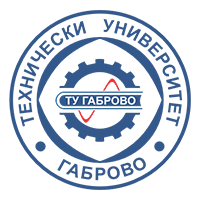
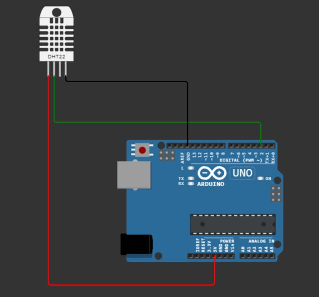

<h1 align="center">
  Technical University of Gabrovo
</h1>

  

# Sensor Hub for Environmental Monitoring
Prototype of a thesis for the completion of a Electronics Master's degree.

## Project Overview:

The project aims to create a system for monitoring environmental parameters using an Arduino UNO R3 development board and three main sensors: a temperature and humidity sensor, a noise level sensor in the surrounding environment, and an air quality sensor. Additionally, a GPS module will be included for determining the geographical location. The system's goal is to provide real-time information about temperature, humidity, noise, air quality, and geographical location.

### Key Features:

- The system will transmit data from the sensors to the central device (Arduino UNO R3).
- A separate Node.js server will read the data transmitted by Arduino via USB and visualize it in a user interface.

## Sensors and Modules:

1. **Temperature and Humidity Sensor - DTH22:** Measures the temperature in the surrounding environment.
2. **Noise Sensor - KY-038 or KY-037:** Reacts to sound levels in the surrounding environment, providing an analog signal that can be measured with the Arduino's analog input.
3. **Air Quality Sensor - MQ Series (e.g., MQ-7 for CO, MQ-135 for CO2 and other gases):** Evaluates the concentration of various gases in the air. Calibration may be required for precise measurements.
4. **GPS Module (e.g., NEO-6M):** Provides the ability to include location information.

The system is designed to allow the addition of new sensors or functionalities in the future.

### Applications:

1. **Environmental Monitoring:** Provides real-time information about environmental conditions, beneficial for public institutions, laboratories, or enthusiasts involved in ecological projects.

2. **Research Projects:** Can be used as a tool for scientific research in the field of ecology and the environment.

3. **Educational Goals:** The project can be utilized in educational environments to stimulate students' interest in electronics and IoT technologies.

# Electric circuit

---

*This project is a work in progress, and additional features or improvements may be added in the future.*