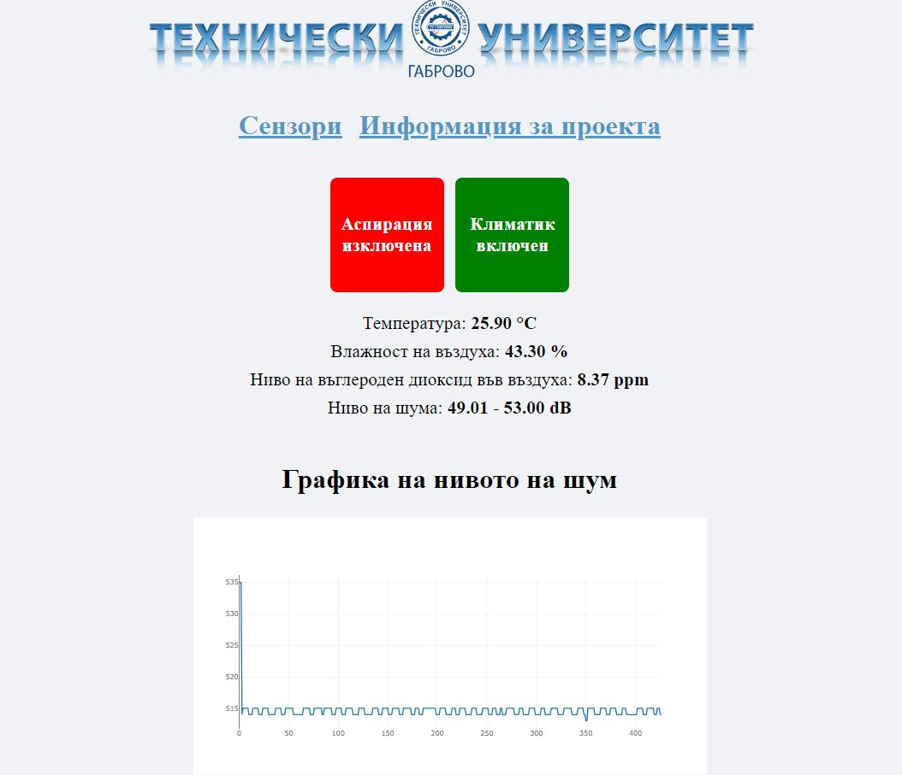
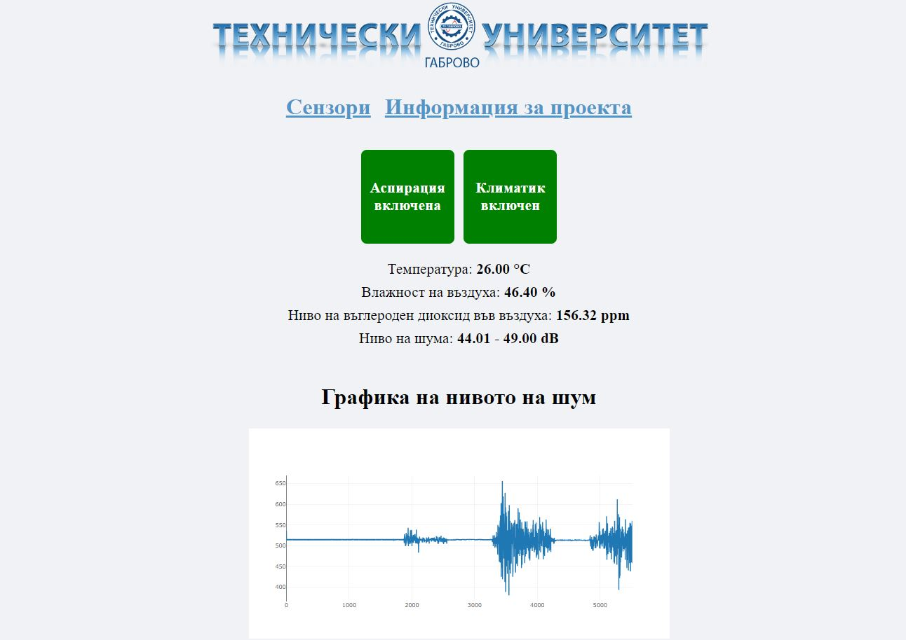
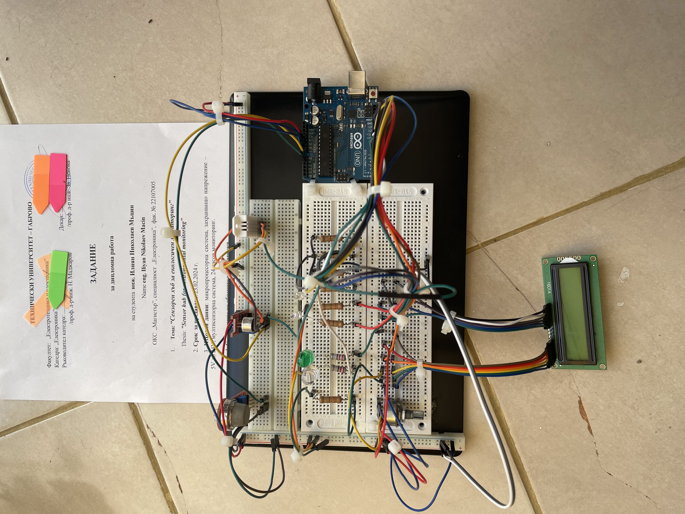
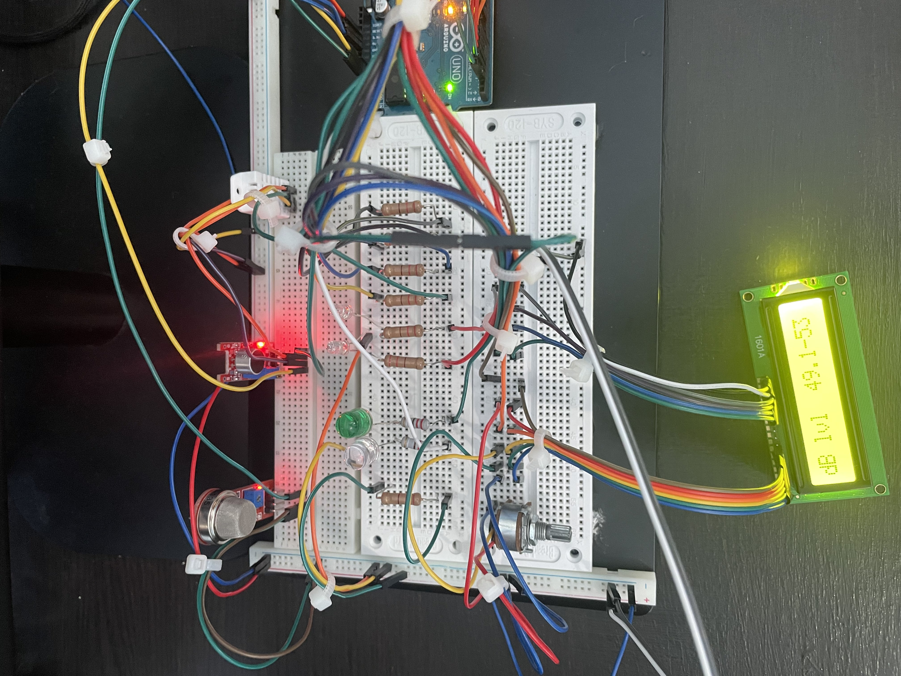

<p align="center">
  
</p>

# Sensor Hub for Environmental Monitoring
Thesis for the completion of a Electronics Master's degree.

# Description
This project involves the use of Arduino UNO R3 and various sensors to monitor temperature, humidity, and air quality. The information is transmitted via the serial port, where a Node.js server reads and provides an interface for visualizing the data.

# Software

## Arduino Software
* Programming Language: **Arduino Programming Language**

#### Used Libraries:
- **DHT.h**
- **MQ135.h**
- **LiquidCrystal.h**

## Web Software
* Programming Language: **JavaScript**
* Markup and Styling: **HTML**, **CSS**
#### Used Libraries:

#### Server
- **express**
- **socket.io**
- **serialport**
- **@serialport/parser-readline**
#### Client
- **socket.io** (via cdn)
- **plotly.js** (via cdn)

## Screenshots from UI



## Electric Circuit




## Components
- 	Single-board microcontroller: **Arduino UNO R3(ATmega328p)** Clone
- Temperature and Humidity Sensor: **DHT22**
- Noise Level sensor: **KY-037** 
- Gas sensor: **MQ-135**
- Display: **LCD1601A HD44780**
- Potentiometer: 10k ohms
- Resistors: 9x 220 ohms 1/4 W
- LEDs: 2x 5MM RED, 1x 10MM WHITE, 1x 10MM GREEN
- Breadbords: MB-102, 2x SYB-120

## Components Descriptions
1. **DHT22 (Temperature and Humidity Sensor):**
   The DHT22 sensor is used to measure both temperature and humidity levels in the environment. It communicates with the Arduino through a digital pin and provides accurate readings.

2. **KY-037 (Noise Level Sensor):**
   The KY-037 sensor detects noise. 

3. **MQ-135 (Gas Sensor):**
   The MQ-135 sensor is capable of sensing various gases such as alcohol, benzene, smoke, and CO2. In this project the sensor measure CO2.

4. **LCD1601A HD44780 (Text Display):**
   The LCD1601A HD44780 display is used to output the sensor readings. It provides a clear visual representation of the data, allowing users to monitor the atmospheric conditions easily.

## Setup and Installation
1. Connect the Sensor Hub to the laptop via USB cable.
2. Upload the sketch (`arduino.ino`) to the hub using the Arduino IDE.
3. Start the Node.js server:
    ```bash
    cd node
    npm install
    node server.js
    ```
4. Open a web browser and visit http://localhost:3000 to view the interface.

## Interface
- The interface visualizes the data from the sensors on WEB application and LCD Display.

## License
This project is licensed under the [MIT License](LICENSE).
