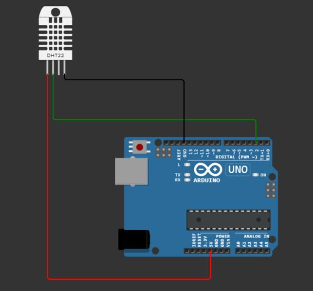

# Technical University of Gabrovo
Prototype of a thesis for the completion of a Master's degree at Technical University Gabrovo.

# Sensor Hub for Environmental Monitoring

The project represents a system for monitoring environmental parameters. It will utilize an Arduino UNO R3 development board and four primary sensors: temperature, noise, humidity, and air quality. The goal of the system is to provide real-time information about temperature, humidity, noise, and air quality.

## Key Features:

- The system will transmit data from the sensors to the central device (Arduino UNO R3).
- A separate server written in Node.js will read the data transmitted by the Arduino via USB and display it in a user interface.

## Sensors:
- Temperature Sensor: Measures the temperature in the surrounding environment.
- Noise Sensor: Responds to levels of sound in the surrounding environment.
- Humidity Sensor: Measures the humidity of the air.
- Air Quality Sensor: Evaluates the concentration of various gases in the air.

The system will be designed to allow for the addition of new sensors or functionalities in the future.

# Applications:

1. **Environmental Monitoring:**
   - Provides real-time information about environmental conditions, valuable for public institutions, laboratories, or enthusiasts involved in ecological projects.

2. **Research Projects:**
   - Can be utilized as a tool for scientific research in the field of ecology and the environment.

3. **Educational Purposes:**
   - The project can be employed in educational environments to stimulate students' interest in electronics and IoT technologies.

# Electric circuit
